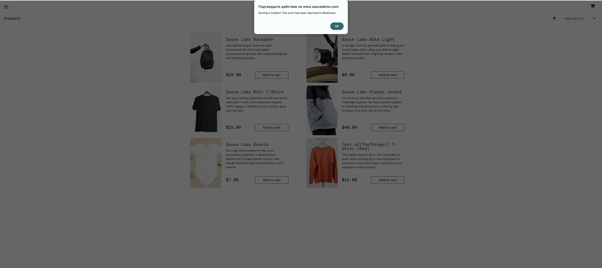

## Задание 3. Составление баг-репорта

### Необходимо найди дефект на ресурсе https://www.saucedemo.com/

**1. Баг-репорт S21-01**

| Поле                      | Короткое описание проблемы, явно указывающее на причину и тип ошибочной ситуации |
|---------------------------|----------------------------------------------------------------------------------|
| Уникальный номер (ID)     | S21-01                                                                           |
| Заголовок                 | Не работает сортировка товаров у пользователя __error_user__                     |
| Проект                    | [сайт Sausedemo](https://www.saucedemo.com/)                                     |
| Описание                  | После авторизации у пользователя __error_user__ на главной странице сайта с товарами не работает сортировка товара. При выборе одной из сортировок "Алфавит по убыванию"/"Цена по возрастанию"/"Цена по убыванию" появляется окошко с ошибкой  |
| Серьезность               | Minor (Низкий)                                                                   |
| Приоритет                 | Средний                                                                          |
| Статус                    | Новый                                                                            |
| Автор                     | voodooch                                                                         |
| Исполнитель               | programmist1                                                                     |
| Шаги к воспроизведению    | <ol> <li>Авторизироваться на сайте: в поле `username` ввести логин `error_user`, в поле `password` ввести `secret_sauce`.</li> <li>Нажать кнопку `Login`.</li> <li>Убедиться в неверном отображении картинок всех товаров.</li> </ol> |
| Фактический результат     | При выборе одной из сортировок появляется окошко с ошибкой                       |
| Ожидаемый результат       | Все сортировки отрабатывают корректно, товар сортируется по одному из выбранных принципов |
| Окружение                 | Версия: 138.0.7204.184 (Официальная сборка) (x86_64)                             |
| Вложения                  |                                                  |
| Дополнительная информация | Отсутствует                                                                      |