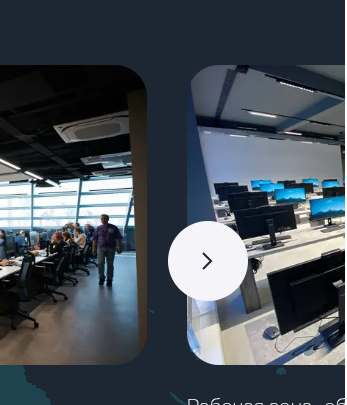

## Задание 3. Движки браузеров

### Тестируем [сайт «Школы 21»](<https://21-school.ru/>) на отображение интерфейса в разных браузерах 
- **Firefox Browser, версия 140.0.4 (64-разрядный)**
- **Google Chrome 138.0.7204.157 (Официальная сборка) (64 бит)**
- **Microsoft Edge 138.0.3351.95 (Официальная сборка) (64-разрядная версия)**

1. **Вёрстка и отступы**
В разных браузерах иногда на несколько пикселей отличаются отступы между блоками.
    - Firefox

    - Chrome

    - Edge

2. **Шрифты немного отличаются.**
Chrome/Edge: шрифты чуть бледнее и толще (особенно заметно в заголовках).
Firefox: шрифты чуть тоньше и текст чётче.
    - Firefox

    - Chrome

    - Edge

3. **Разное расположение элементов**
    - Firefox

    - Chrome

4. **Специальный режим при просмотре видео**
В разделе "Отзывы участников" при просмотре видео, кнопка "просмотр в отдельно окне" находится в разных местах и изображена по разному. А у браузера Chrome такая кнопка не отображается:
    - Firefox

    - Edge

5. **Анимации и плавность**
Анимации (например, плавное появление блоков) работают, еле заметно, по-разному. В Chrome/Edge чуть менее плавно, чем Firefox.

6. **Форма "Заявка на поступление"**
    - Firefox: визуально цвет полей и цвет вокруг полей немного отличается от отображения в браузерах Chrome/Edge (есть градиент). Текст плейсхолдера полностью помещается.
    - Chrome/Edge: Нет градиента у цвета, текст плейсхолдера не полностью вмещается в поле: буква "б" как будто бы обрезается.

        - Firefox
    
        - Chrome/Edge
    