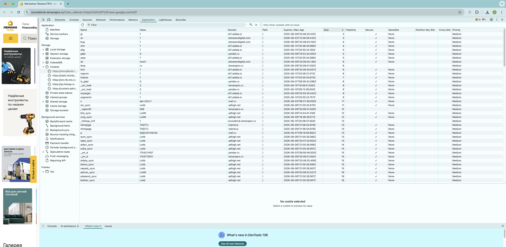

## Задание 5. Cookies

- Для выполнения задания переходим на сайт [Лемана ПРО](<https://krasnoyarsk.lemanapro.ru/>).
- Открываем Chrome DevTools и во вкладке «Application» выбераем Cookies.
- Смотрим какие данные записал сайт:

Каждая cookie содержит несколько ключевых полей:
1. **Name** - название cookie, например, PVID, as-user.
2. **Value** - сами данные (они закодированны).
3. **Domain** - какой домен установил cookie (например, `.yandex.ru`).
4. **Path** - путь на сайте, для которого действует cookie (обычно / - корень).
5. **Expires / Max-Age** - срок действия (может быть "Сеанс" - удаляется после закрытия браузера).
6. **HttpOnly** - если галочка, cookie доступна через JavaScript.
7. **Secure** - если галочка, cookie передается только по HTTPS.
8. **SameSite** - политика безопасности (None, Lax, Strict).
9. **Priority** - приоритет (Low, Medium, High).

В моём случае сайт использует **более 100 cookies**. Например, `PVID`, длинная закодированная строка, вероятно, содержит уникальный идентификатор пользователя, данные о сессии и, возможно, метки о поведении на сайте. Используется для трекинга и персонализации рекламы.

### Подробнне о флагах HttpOnly, SameSite и Secure

Столбец **HttpOnly** в настройках cookie означает, что данный cookie предназначен только для использования сервером и не доступен для клиентского JavaScript.
Если HttpOnly установлен в true, то браузер будет считать этот cookie доступным только для сервера и не будет предоставлять его для использования в клиентском JavaScript.

Столбец **SameSite** в настройках cookies определяет, в каких случаях браузер будет отправлять cookie-файл на сервер при межсайтовых запросах (когда пользователь переходит на другой сайт).
*SameSite=Strict:* Cookie-файл будет отправляться только на сайт, который его установил.
*SameSite=Lax:* Cookie-файл будет отправляться в запросах с того же сайта и в GET-запросах с других сайтов (например, при переходе по ссылке).
*SameSite=None:* Cookie-файл будет отправляться в межсайтовых запросах. Для использования этого значения, cookie-файл также должен быть помечен как Secure, что означает, что он будет отправляться только по HTTPS. 

Столбец **Secure** в cookies указывает, что cookie должна передаваться на сервер только по защищенному HTTPS-соединению. Это значит, что если сайт работает по обычному HTTP, то cookie с флагом "Secure" не будет отправлена на сервер.