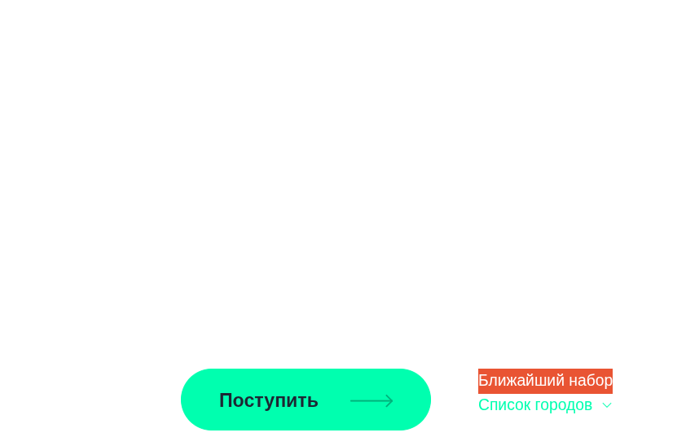
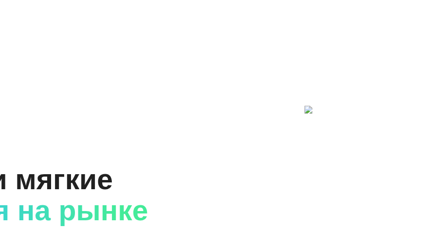
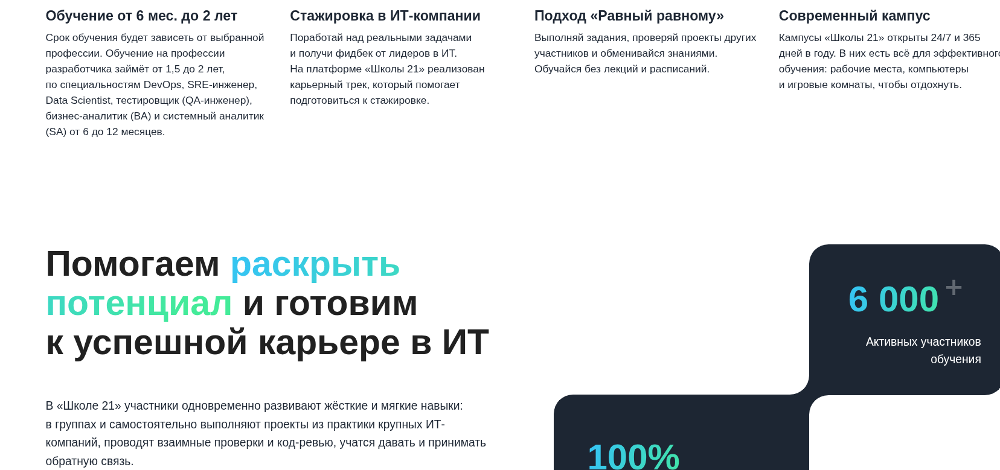
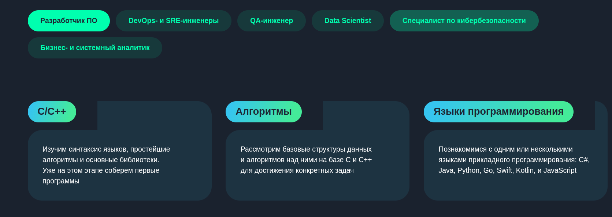

## Задание 6. Тестирование UI веб-сайта

В сравнии с макетом, реализованный сайт имеет следующие ошибки:
+ В первом разделе отсутствует изображение, вместо него - белый фон. Из-за этого теряется часть текста белого цвета (сливается с белым фоном).
+ Отсутствуют изображения (в черных кругах значки календаря, сумки, людей, звезды) под кнопкой "Поступить", вместо изображений - белый фон.
+ Блоки с текстом под заголовками: Обучение от 6 мес. до 2 лет; Стажировка в ИТ-компании и других, имеют больший размер, чем в макете.
+ Аналогично блок с заголовком "Помогаем раскрыть потенциал и готовим к успешной карьере в ИТ" и текст под ним имеет больший размер.
+ Кнопка "Подробнее о трудоустройстве" должна находиться немного ниже, согласно макету.
+ В разделе с названием "Программа обучения" блок со всем содержимым должен иметь не просто скругленную форму прямоугольника, а правый угол должен иметь определенный в макете дизайн.
+ Блоки с текстом под заголовками "C/C++", "Алгоритмы", "Языки программирования" имеют острые углы, а должны иметь скругленные углы.
+ Текст блока "И проходят подготовку к работе в ИТ‑компании" необходимо поправить с грамотным переносом предлогов.
+ Блок с текстом под заголовком "Карьерный трек", "Стажировка" должен быть меньшего размера, согласно макету.
+ Кнопка "Алгоритмы" должна находиться под кнопкой "C/C++".
+ В блоке "В «Школу 21» может поступить любой желающий" отсутствуют сразу несколько изоражений: 4 голубых значка и фото под блоком "50%.."
+ Здесь также некорректно отображается блок "50%..". Необходимо уменьшит шрифт текста, чтобы текст полностью поместился в блок.
+ Блок с названием "Этапы поступления" должен иметь не скругленную форму прямоугольника, а правый угол должен иметь определенный в макете дизайн.
+ Здесь блоки "Игра" и остальные необходимо увеличить и разместить по центру.
+ Раздел "Начало обучения": отсутсвует картинка, и блок с текстом 6 мес, 18 мес необходимо оформить согласно макету.
+ Раздел "Начало обучения" те же замечания по размеру блоков. Необходимо сделать, согласно макету.
+ Раздел "Участники и выпускники о «Школе 21»" необходимо сделать согласно макету, убрать видео.
+ Раздел "Методология" сделать согласно макету. Отсутсвует картинка. Убрать кнопку "Подробнее о методике".
+ Полносью отсутствует раздел "Кампусы".
+ Раздел "Заявка на поступление" исправить форму, согласно макету.
+ Раздел "Ответы на вопросы" - убрать лишние кнопки: поступление и обучение.
+ Исправить последний блок, согласно макету.

1. **Баг-репорт S21-01**

| Поле                   | Короткое описание проблемы, явно указывающее на причину и тип ошибочной ситуации                                                                |
|------------------------|-------------------------------------------------------------------------------------------------------------------------------------------------|
| Уникальный номер (ID)  | S21-01                                                                                                                                          |
| Заголовок              | Отсутствуют изображения на веб-странице                                                                                                         |
| Проект                 | веб-страница                                                                                                                                    |
| Описание               | При загрузке веб-страницы отсутствуют несколько изображений, вместо них - белый фон, либо значок изображения. Необходимо сверить пути или наличие необходимой картинки на сервере.
| Серьезность            | Незначительный                                                                                                                                  |
| Приоритет              | Высокий                                                                                                                                         |
| Статус                 | Новый                                                                                                                                           |
| Автор                  | voodooch                                                                                                                                        |
| Исполнитель            | programmist1                                                                                                                                    |
| Шаги к воспроизведению | Открыть веб-страницу сайта                                                                                                                      |
| Фактический результат  | Белый фон вместо изображений, либо значок изображения вместо нужной картинки                                                                    |
| Ожидаемый результат    | Все картинки присутствуют на веб-странице                                                                                                       |
| Окружение              | Google Chrome 138.0.7204.157 (Официальная сборка) (x86_64) (64-разрядный)                                                                                     |
| Вложения               |                                                                                               |

3. **Баг-репорт S21-02**

| Поле                   | Короткое описание проблемы, явно указывающее на причину и тип ошибочной ситуации  |
|------------------------|-----------------------------------------------------------------------------------|
| Уникальный номер (ID)  | S21-02                                                                            |
| Заголовок              | Размер блоков по всей веб-странице с тектом имеет больший размер, чем необходимо. |
| Проект                 | веб-страница                                                                      |
| Описание               | Размер блоков с тектом по всей веб-странице имеет больший размер, чем необходимо. Также необходимо перенести все предлоги в тексте на новую строку, а не оставлять на предыдущей |
| Серьезность            | Тривиальный                                                                       |
| Приоритет              | Низкий                                                                            |
| Статус                 | Новый                                                                             |
| Автор                  | voodooch                                                                          |
| Исполнитель            | programmist1                                                                      |
| Шаги к воспроизведению | Открыть веб-страницу сайта                                                        |
| Фактический результат  | Размер блоков с тектом по всей веб-странице не соответствует шаблону.             |
| Ожидаемый результат    | Размер блоков с тектом по всей веб-странице соответствует шаблону.                |
| Окружение              | Google Chrome 138.0.7204.157 (Официальная сборка) (x86_64) (64-разрядный)         |
| Вложения               |                                                          |

4. **Баг-репорт S21-03**

| Поле                   | Короткое описание проблемы, явно указывающее на причину и тип ошибочной ситуации                    |
|------------------------|-----------------------------------------------------------------------------------------------------|
| Уникальный номер (ID)  | S21-03                                                                                              |
| Заголовок              | Блоки с текстом под заголовками C/C++, Алгоритмы, Языки программирования квадратные                 |
| Проект                 | веб-страница                                                                                        |
| Описание               | Блоки с текстом под заголовками C/C++, Алгоритмы, Языки программирования квадратные                 |
| Серьезность            | Тривиальный                                                                                         |
| Приоритет              | Низкий                                                                                              |
| Статус                 | Новый                                                                                               |
| Автор                  | voodooch                                                                                            |
| Исполнитель            | programmist1                                                                                        |
| Шаги к воспроизведению | Открыть веб-страницу сайта                                                                          |
| Фактический результат  | Блоки с текстом под заголовками C/C++, Алгоритмы, Языки программирования квадратные                 |
| Ожидаемый результат    | Блоки с текстом под заголовками C/C++, Алгоритмы, Языки программирования скругленные, как в шаблоне |
| Окружение              | Google Chrome 138.0.7204.157 (Официальная сборка) (x86_64) (64-разрядный)                           |
| Вложения               |                                                                            |

