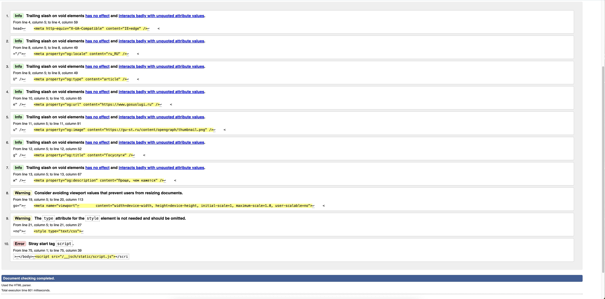

## Задание 7. Валидация HTML

С помощью [валидатора](<https://validator.w3.org/>) проверим [сайт Госуслуги](<https://esia.gosuslugi.ru/>) на корректность кода, соответствие стандартам и качество реализации веб-страниц.

**Ошибки, которые выдал валидатор по результату проверки:**

- **Error**: Stray start tag script.
From line 75, column 1; to line 75, column 39
`>↩</body>↩<script src="/__jsch/static/script.js"></scri`
*(Незакрытый или неправильно размещённый тег)*

**Также помимо ошибок, отображаются предупреждения и доп. информация:**

